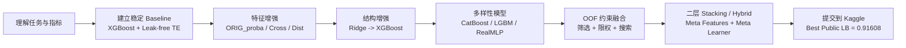
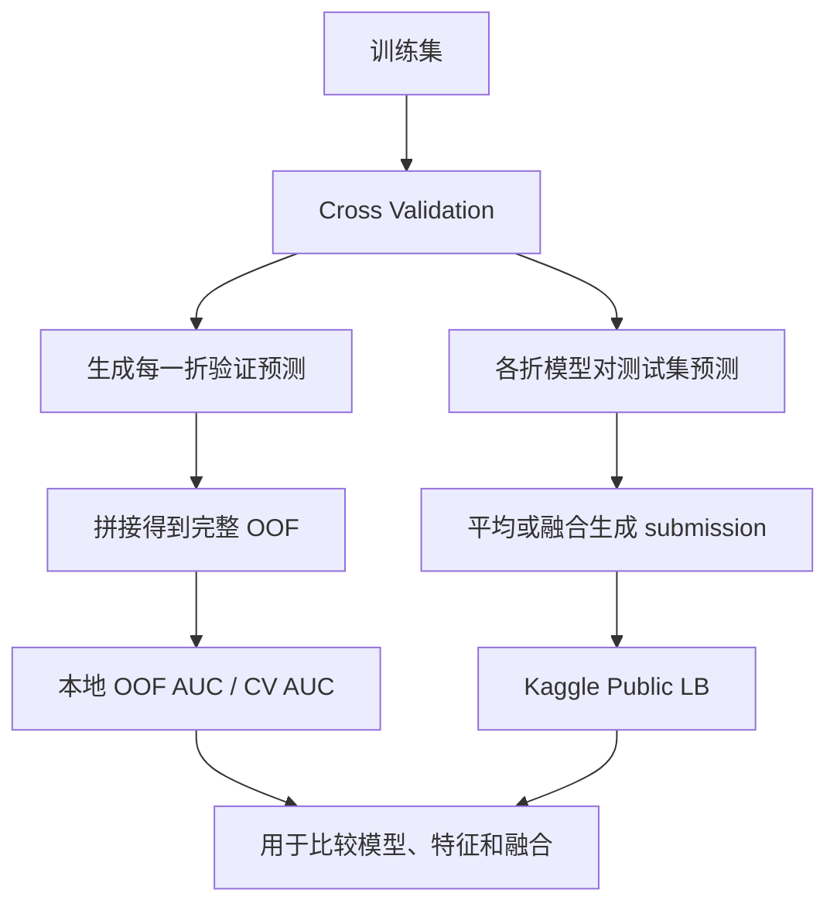
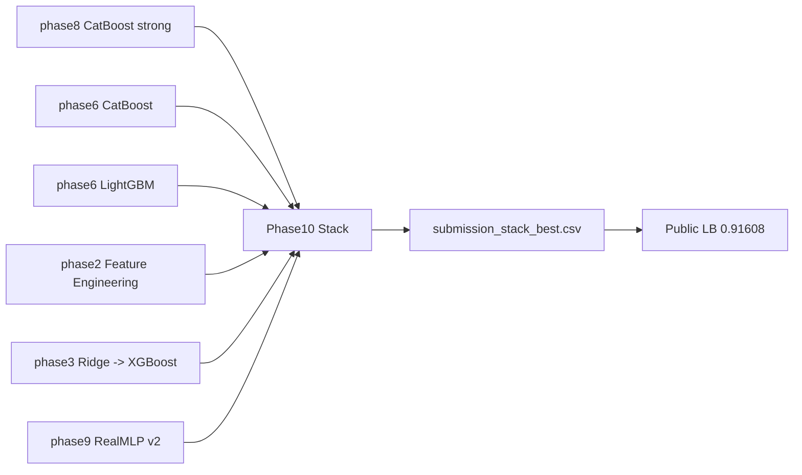

# PS-S6E3: 面向初学者的客户流失预测实战报告

## 摘要

本文面向刚接触 Kaggle 表格竞赛、二分类任务和集成学习的读者，系统总结 `Kaggle Playground Series - Season 6 Episode 3` 当前项目方案。赛题目标是根据电信客户属性预测用户是否流失，评价指标为 `ROC AUC`。  
项目在严格工程约束下推进：所有正式训练与提交都在 Kaggle 远程环境完成，本地只做最小链路验证、OOF 分析和融合搜索。整个方案从 `XGBoost + leak-free target encoding` 基线出发，逐步扩展出原始数据迁移特征、两阶段 `Ridge -> XGBoost`、`CatBoost/LightGBM` 多样性分支、受限融合，以及后续的二层 `stacking / hybrid` 管线。  
截至 `2026-03-23`，当前最佳公开榜成绩为 `0.91608`，来自 `phase10 stack oof v1`；当前最佳本地 OOF 为 `0.9184734996`，来自 `phase14` stronger stack pipeline。最新实验表明，本题的下一轮突破点已经不再是继续抠二层权重，而是引入新的低相关底模，再把它们送入已经验证有效的 `phase10-14` stacking 框架。

## 0. 一图总览

如果你只想先抓住整篇报告的主线，可以先看下面这张总览表和流程图。

| 模块 | 它在做什么 | 为什么重要 | 当前结论 |
| --- | --- | --- | --- |
| 基线 | 用 `XGBoost + 防泄漏目标编码` 建立稳定起点 | 决定后续实验是否有可信参考系 | 必须先做对 |
| 特征增强 | 引入原始 Telco 数据迁移信号 | 给模型补充更强的统计先验 | 有稳定小幅收益 |
| 结构增强 | 尝试 `Ridge -> XGBoost` 两阶段路线 | 提供与单一树模型不同的建模视角 | 可作为融合候选 |
| 多样性模型 | 引入 `CatBoost`、`LightGBM`、`RealMLP` | 降低模型同质化，提高融合上限 | `CatBoost` 最强，`RealMLP` 适合低权重补丁 |
| 受限融合 | 基于 `OOF` 进行筛选、限权和搜索 | 防止“越融越差” | `phase9` 将线上 best 推到 `0.91606` |
| 二层 Stacking / Hybrid | 把多模型预测再次作为输入做二层学习 | 吃到更高阶的模型互补关系 | `phase10` 线上 best 达到 `0.91608` |



## 1. 本文适合谁阅读

如果你满足以下任意一点，这篇报告就值得先完整读一遍：

- 刚开始做 Kaggle，不太理解 `CV`、`OOF`、`Public LB` 的关系。
- 知道 `XGBoost`、`CatBoost` 这些名字，但不知道它们在项目里应该怎样分工。
- 听说过“特征工程”“目标编码”“模型融合”，但不知道应该先做什么、后做什么。
- 想把一个比赛项目从“能提交”推进到“能稳定冲榜”，但不想一开始就走复杂路线。

本文不会假设读者已经熟悉本项目代码。相反，文中会尽量把每个关键概念解释清楚，再说明本项目为什么这样设计。

## 2. 赛题背景

### 2.1 任务定义

- 比赛：`playground-series-s6e3`
- 任务类型：二分类
- 目标列：`Churn`
- 评价指标：`ROC AUC`

“客户流失预测”本质上是一个排序问题：模型要尽量把更可能流失的用户排在更前面。它不要求你必须给出非常精确的概率值，但要求正样本整体排名高于负样本。

### 2.2 业务直觉

如果从业务角度理解这道题，可以把它想成：

- 输入：一个客户的套餐、使用习惯、服务种类、付费信息等
- 输出：这个客户是否会流失

在真实业务中，这类模型的用途很多，例如：

- 识别高风险客户，提前干预
- 优化优惠券或续费策略
- 评估某些服务组合是否更容易引起流失

虽然这是 Playground 赛题，但它依然保留了真实表格任务的很多典型特征：类别特征较多、数据规模不小、线上分数和本地验证可能存在偏差、后期收益很依赖融合与特征迁移。

### 2.3 数据背景

- 训练集：`594,194` 行，`21` 列（包含目标列）
- 测试集：`254,655` 行，`20` 列
- 数据性质：主赛题数据为合成数据，但分布与经典 Telco Customer Churn 数据高度相关

这一点非常重要。  
对初学者来说，最容易忽略的点是：虽然比赛给的是合成数据，但它并不是“完全凭空生成”的随机表。很多高分方案都发现，经典 Telco 原始数据里包含的条件分布信息，能够迁移到本题里。  
这也是为什么本项目后期重点转向了 `ORIG_proba`、条件分位数、分布偏移等“原始数据迁移特征”。

## 3. 做这道题前必须理解的几个核心概念

### 3.1 什么是 ROC AUC

`ROC AUC` 可以理解为：

- 随机拿一个真实流失用户
- 再随机拿一个真实未流失用户
- 模型把前者排在后者前面的概率

如果 `AUC = 0.5`，说明模型几乎和随机猜一样。  
如果 `AUC = 1.0`，说明模型能把所有正负样本完全排开。  
本题里能做到 `0.91+` 已经说明模型具有比较强的区分能力。

`ROC AUC` 的一个好处是它不依赖固定阈值。  
这意味着你不用先决定“概率大于多少算流失”，而是先专注于排序能力。这非常适合 Kaggle 二分类比赛。

### 3.2 什么是 CV、OOF 和 Public LB

这是初学者最容易混淆的一组概念。

| 术语 | 含义 | 作用 |
| --- | --- | --- |
| `CV` | 交叉验证（Cross Validation） | 在训练集内部估计模型泛化能力 |
| `OOF` | Out-of-Fold 预测 | 每个训练样本都由“没见过它的模型”预测一次 |
| `Public LB` | Kaggle 公共榜分数 | 线上对测试集一部分样本打分后的结果 |

可以把它们理解成三层：

1. `CV/OOF` 是本地或远程训练时可控的验证机制。
2. `Public LB` 是 Kaggle 给你的线上反馈。
3. 真正最终排名还要看 `Private LB`，它在比赛结束前看不到。

为什么本项目一直强调 `OOF`？

- 因为 `OOF` 是最接近“训练时可重复验证”的依据。
- 如果只盯着 `Public LB`，很容易追到波动噪声。
- 真正稳健的融合和 stacking，必须建立在高质量 `OOF` 之上。

下面这张图可以把三者关系看得更直观一些：



### 3.3 什么是泄漏，为什么要防泄漏

“泄漏”指的是模型在训练阶段看到了本不应该提前知道的信息。  
在表格比赛中，最常见的泄漏来源之一就是目标编码（Target Encoding）做错。

例如，一个类别变量是 `ContractType`，如果你直接用整个训练集去算：

```text
ContractType = "Monthly" -> 平均流失率
```

然后再把这个均值回填到训练样本上，就会出现问题：

- 某一行样本自己的标签也参与了这个均值的计算
- 模型实际上“偷看”到了部分真实答案

这会让本地分数虚高，但线上往往掉分。

因此，本项目里所有目标编码都坚持一个原则：

- 外层 fold 用于模型验证
- 内层 fold 用于在训练折内部生成 OOF 编码

这就是文中反复提到的 `leak-free target encoding`。

为了让这个概念更容易记住，可以直接看下面这张对照表：

| 做法 | 是否偷看了当前样本的目标 | 本地分数表现 | 线上风险 | 是否推荐 |
| --- | --- | --- | --- | --- |
| 直接用全量训练集统计目标均值再回填 | 是 | 往往虚高 | 很高 | 否 |
| 外层验证 + 内层 OOF 目标编码 | 否 | 更保守但更可信 | 明显更低 | 是 |

对初学者来说，有一个很简单的判断标准：

- 如果某一行训练样本的编码值，间接用到了它自己的标签，那就已经有泄漏风险。

### 3.4 什么是模型多样性

很多新手会认为：  
“只要把更多模型平均一下，分数就一定更高。”

实际上不是。

融合真正需要的是“多样性”，也就是：

- 模型要足够强
- 模型之间还不能太像

如果两个模型都很强，但它们犯错的方式几乎一模一样，那么融合收益往往很小。  
本项目后期最重要的经验之一，就是从“继续打磨树模型”转向“寻找与树模型低相关的新模型族”。

## 4. 项目的工程约束

本项目不是一个可以随意本地开跑的大型实验仓库，而是有明确边界：

- 所有正式训练只能在 Kaggle 远程执行
- 本地只做最低程度的脚本冒烟和结果校验
- 本地主要承担：
  - 代码组织
  - 结果归档
  - OOF 分析
  - 融合权重搜索
  - 提交文件管理

这样设计有两个实际好处：

1. 环境统一，避免“本地能跑，Kaggle 跑不通”。
2. 可以把精力集中在可复现的实验流程上，而不是机器差异上。

项目中比较关键的目录包括：

- `kaggle_kernel/phase8_catboost_strong/`：强化版 CatBoost 单模
- `kaggle_kernel/phase9_realmlp_tabm_diverse/`：RealMLP/TabM 多样性分支
- `kaggle_kernel/phase7_blend_oof/`：基于 OOF 的受限融合搜索
- `scripts/smoke/`：本地最小可运行验证脚本

## 5. 整体解题策略

本项目没有直接从复杂模型起步，而是采用了更适合初学者复制的路线：

1. 先做一个稳定、可提交、可解释的基线
2. 再逐步增加特征和模型多样性
3. 最后才进入融合和冲榜阶段

这样做的原因很简单：

- 没有可靠基线时，后面所有提升都很难判断是否真实有效
- 没有稳定 `OOF` 时，融合只是“碰运气”
- 没有阶段性归档时，很容易在大量实验里迷失

你可以把整个项目理解成一条不断迭代的主线：

`稳定基线 -> 特征增强 -> 结构增强 -> 模型多样性 -> 受限融合 -> 二层 stacking / hybrid -> 小幅冲榜`

为了帮助初学者把“路线”而不是“细节”先记住，可以把项目推进顺序再压缩成下面这张图：


对应的阶段任务表如下：

| 阶段 | 核心目标 | 关键产物 | 对初学者最重要的提醒 |
| --- | --- | --- | --- |
| Baseline | 建立可信验证链路 | `OOF`、`submission`、`cv_metrics` | 先把流程做对，不要急着堆复杂度 |
| Feature Engineering | 增加有效统计信号 | 新特征列、增强版配置 | 小增益也值得记录 |
| Two-stage Modeling | 引入结构差异 | 一级预测、二级模型 | 结构差异本身就是信息 |
| Diverse Models | 找更低相关的强模型 | `CatBoost`、`LGBM`、`RealMLP` 结果 | 不要只盯着单模分数 |
| Blend | 把多模型收益转成线上收益 | 融合配置、权重搜索报告 | 融合必须依赖高质量 `OOF` |
| Stack / Hybrid | 用二层学习吃掉剩余互补信息 | `stack_report`、`hybrid_report`、meta 配置 | 二层结构有效，但不能替代新底模 |

## 6. 各阶段方案详解

### 6.1 Baseline：XGBoost + 防泄漏目标编码

这是整个项目的起点，也是最值得初学者吃透的一步。

#### 6.1.1 为什么先选 XGBoost

选择 `XGBoost` 作为基线，主要因为它具备以下特点：

- 对表格数据非常强
- 对数值特征和编码后特征都比较友好
- 参数空间相对成熟，社区经验丰富
- 即使不做极端复杂特征，也能快速得到可靠起点

#### 6.1.2 为什么要配合目标编码

表格任务里常常有很多类别特征。  
直接独热编码（OHE）虽然简单，但在高基数类别场景下可能不够经济。  
目标编码的思想是：

- 用某个类别在训练数据中的平均标签来表示这个类别

例如：

```text
PaymentMethod = "Electronic check"
-> 该类别在训练集中对应的平均 Churn 概率
```

但正如前面解释的，这一步很容易泄漏，所以必须做成防泄漏版本。

#### 6.1.3 本项目的基线流程

基线阶段的训练流程可以概括为：

1. 对训练集做外层 `5-fold` 切分
2. 每次拿 `4 folds` 做训练，`1 fold` 做验证
3. 在训练折内部再做内层 OOF 目标编码
4. 用编码后的特征训练 `XGBoost`
5. 保存每个验证折上的预测，拼成完整 `OOF`
6. 对测试集做多折预测并求平均，生成 `submission`

这个流程的意义是：

- 训练集上的每一行样本都只会被“没见过它标签”的编码器和模型预测
- 得到的 `OOF` 才能作为可信的本地验证基础

#### 6.1.4 基线结果

- Baseline OOF AUC：`0.9162936`
- Baseline Public LB：`0.91384`

这个分数说明：

- 基线本身已经不弱
- 问题不在于“完全不会建模”
- 后续提升应该建立在此基础上，而不是推翻重做

#### 6.1.5 初学者应该从基线学到什么

基线阶段最重要的收获不是分数，而是方法论：

- 先把验证链路做对
- 再去谈特征和模型升级

如果你的目标编码是错的，后面的复杂模型只会把错误放大。

### 6.2 Phase-1：伪标签门控

#### 6.2.1 伪标签是什么

伪标签（Pseudo Labeling）是一个经典技巧：

- 先用模型给测试集打分
- 选择那些模型“非常确定”的测试样本
- 把这些高置信样本的预测结果当作临时标签，加入训练集重新训练

它的逻辑是：  
如果模型对某些测试样本极其自信，那么这些样本也许能帮助模型进一步学习测试分布。

#### 6.2.2 为什么本项目没有重押伪标签

本项目扫描了多个高置信阈值，例如：

- `0.995`
- `0.997`
- `0.999`

结论是：

- 低阈值下引入的伪标签噪声偏大
- 高阈值虽然更安全，但增益非常有限
- 单独依赖伪标签，不能形成真正的突破

#### 6.2.3 阶段结果

- `pseudo label th999` 的 Public LB 约为 `0.91386`
- 与基线相比只有非常轻微的边际变化

#### 6.2.4 给初学者的启发

伪标签不是“用了就一定涨分”的魔法。  
它更像一个需要严控风险的辅助工具。

如果你没有稳定基线和高质量验证，伪标签很容易让你误以为模型变强了，实际上只是放大噪声。

### 6.3 Phase-2：特征增强

#### 6.3.1 为什么要做特征增强

当基线已经比较稳时，第一种常见上分方式不是换模型，而是加信息量更高的特征。

本项目这一阶段的重点是：

- 适度引入与原始 Telco 数据相关的迁移信号
- 保持特征工程不过度膨胀
- 不破坏原有的验证框架

#### 6.3.2 核心特征类型

这一阶段引入了几类较重要的特征：

- `ORIG_proba`：从原始 Telco 数据迁移来的概率映射信号
- 类别交叉特征：把两个有业务相关性的类别组合起来
- 受限统计映射：把更细粒度的分布信息编码成数值特征

这些特征的目标不是“把表做得越来越大”，而是：

- 让模型看到更多与流失相关的条件分布信息

#### 6.3.3 阶段结果

- `phase2 fe v1 pseudo999` OOF AUC：`0.9163282`
- Public LB：`0.91387`

相对基线提升不大，但方向是正确的。  
这说明特征增强可以提供真实增益，只是此时增益还比较温和。

#### 6.3.4 给初学者的启发

不要期待单次特征工程就带来巨大跃升。  
在高质量基线上，哪怕是 `0.0001` 到 `0.0003` 的稳定提升，也可能是真实有效的。

### 6.4 Phase-3：两阶段 Ridge -> XGBoost

#### 6.4.1 这条路线在做什么

这一阶段尝试了一个更有结构感的方案：

1. 第一级先用 `Ridge`
2. 第二级再把第一级预测值作为新特征，交给 `XGBoost`

可以把它理解为一个轻量的两阶段建模：

- `Ridge` 更擅长提取线性、平滑、可泛化的信号
- `XGBoost` 再去学习非线性关系和交互

#### 6.4.2 为什么它有意义

虽然 `Ridge` 本身不是这类比赛里最强的单模，但它有一个重要价值：

- 它和树模型的归纳偏好不同

这意味着它可能提供一部分“树模型不容易自然学出来”的信息。  
即使单模不是顶尖，它也有可能在后续融合中发挥作用。

#### 6.4.3 阶段结果

- `phase3 ridge xgb v1` OOF AUC：`0.9162443`
- Public LB：`0.91400`

这个结果很有代表性。  
它的 OOF 没有明显超过前面方案，但线上反而更好，说明它捕捉到了一些对测试分布更友好的信号。

#### 6.4.4 给初学者的启发

不要只看单一 OOF 数字。  
还要结合模型结构差异和线上表现，判断一个分支是否值得保留进融合池。

### 6.5 Phase-4：早期融合验证

在项目中期，已经出现了多个“各有优缺点”的提交版本。  
这时做了一轮早期融合，目的不是直接冲最高分，而是验证一个问题：

- 多个中等强度模型叠加后，是否能稳定超过单模

结果显示：

- 早期融合把 Public LB 推到了 `0.91407`

虽然这个阶段的融合还比较朴素，但它证明了一件事：

- 本题确实有融合空间

这为后面的 OOF 约束融合打下了方向基础。

### 6.6 Phase-5：Advanced XGBoost 失败案例

这是本项目里非常重要的一段反例，尤其值得初学者重视。

#### 6.6.1 为什么要记录失败

很多报告只写成功路线，不写失败路线。  
但对实战来说，知道哪些路不该再走，和知道哪些路该走，一样重要。

#### 6.6.2 发生了什么

`phase5_xgb_advanced` 曾经尝试走更激进的高级 XGBoost 路线。

其中：

- v1 有原始 Telco 数据挂载问题，导致参考分布不可靠
- v2 修复挂载后，OOF AUC 仍然只有 `0.9098060`
- 对应 Public LB 甚至掉到 `0.89306`

#### 6.6.3 这说明什么

这说明问题不只是“数据挂载错了”，而是这条实现路线本身就不够稳健。  
换句话说：

- 某些复杂方案看起来特征很多、逻辑很长
- 但如果关键映射链路不稳定，最终结果反而可能比简单方案更差

#### 6.6.4 给初学者的启发

复杂不等于高级。  
如果一个方案同时满足以下两个条件，就要高度警惕：

- 特征链路很长
- 验证结果和线上结果严重背离

这类方案不应继续投入大量时间。

### 6.7 Phase-6：多样性树模型分支

#### 6.7.1 为什么要引入 CatBoost 和 LightGBM

到了这个阶段，项目已经证明：

- 继续在 XGBoost 周边小修小补，收益越来越有限

因此开始尝试新的树模型族：

- `CatBoost`
- `LightGBM`

它们和 `XGBoost` 都属于梯度提升树，但实现细节不同：

- `CatBoost` 对类别特征处理能力很强，往往在含类别列的任务里表现稳定
- `LightGBM` 训练速度快，树生长策略与 XGBoost 不同

#### 6.7.2 阶段结果

- `phase6 catboost v1` OOF AUC：`0.9180636`
- `phase6 catboost v1` Public LB：`0.91581`
- `phase6 lgbm v1` OOF AUC：`0.9158487`
- `phase6 ensemble v1` OOF AUC：`0.9179283`
- `phase6 ensemble v1` Public LB：`0.91567`

最关键的结论是：

- `CatBoost` 成为当时最强单模型
- 这说明“换模型族”比“继续细调同构 XGB”更有效

#### 6.7.3 给初学者的启发

当一个模型族已经被你调到比较成熟时，下一步不一定是更细的参数搜索。  
有时更高效的选择是：

- 引入一个偏好不同的新模型族

### 6.8 Phase-7：基于 OOF 的受限融合

这是本项目非常关键的一步，也是从“能做融合”走向“会做融合”的分水岭。

#### 6.8.1 为什么不能直接平均所有模型

因为那样通常会遇到两个问题：

1. 强模型被弱模型拖累
2. 高相关模型重复投票，实际没有增加信息

所以本项目没有直接“全塞进去”，而是采用更严格的融合流程。

#### 6.8.2 融合流程

核心流程如下：

1. 先看每个候选模型的单模 OOF AUC
2. 再检查模型之间的预测相关性
3. 对过高相关的候选做过滤或限权
4. 在剩余模型上搜索 `rank` 或 `prob` 权重

这一步非常重要。  
它意味着融合不再依赖“感觉哪个模型不错”，而是有了可验证的约束依据。

#### 6.8.3 阶段结果

- `phase6 candidate blend opt v1` Public LB：`0.91591`

这说明：

- 基于 OOF 的受限融合，已经开始把多个模型的价值稳定转化为线上收益

### 6.9 Phase-8：强化版 CatBoost

#### 6.9.1 为什么继续强化 CatBoost

到了这里，项目已经确认 `CatBoost` 是最强单模方向之一。  
因此，后续不是“抛弃它换别的”，而是继续给它注入更强的特征信号。

强化版 `phase8` 的一个重要事实是：

- 统一使用了 `119` 个特征
- 其中新增的原始迁移信号包括：
  - `orig_single`：`41`
  - `orig_cross`：`15`
  - `dist`：`8`

这说明 Phase-8 的核心不是简单调参，而是：

- 把来自原始 Telco 数据的有效统计信号系统化纳入特征空间

#### 6.9.2 阶段结果

- `phase8 catboost strong v1` OOF AUC：`0.9181653`
- `phase8 catboost strong v1` Public LB：`0.91591`
- 进一步并入融合后，`phase8 candidate blend opt v1` Public LB 达到 `0.91602`

#### 6.9.3 给初学者的启发

最强单模未必来自最花哨的模型。  
很多时候，更重要的是：

- 让强模型吃到更高质量的特征

### 6.10 Phase-9：RealMLP 作为低权重多样性补丁

#### 6.10.1 为什么引入 RealMLP

当树模型路线已经比较成熟后，继续上分的瓶颈通常变成：

- 缺乏真正低相关的新模型

`RealMLP` 属于和树模型归纳偏好差异更大的模型族。  
它不一定能成为最强单模，但它有机会带来树模型没有覆盖到的错误修正能力。

#### 6.10.2 本项目的关键发现

`RealMLP` 单独作为提交并不强：

- `phase9_realmlp_v2` OOF AUC：`0.9147087`

如果只看这个数字，你可能会得出一个错误结论：

- “这个模型没用，可以删掉。”

但本项目进一步发现：

- 当它以大约 `0.12` 的低权重注入现有最佳融合时，反而能带来稳定增益

也就是说：

- 它不是强单模
- 但它是有价值的“多样性补丁”

#### 6.10.3 当前最佳融合结果

基于归档结果，当前最佳融合的核心候选包括：

- `phase8_cat_v1`
- `phase6_cat_v1`
- `phase2_fe_v1`
- `phase3_ridge_xgb_v1`
- `phase6_lgbm_v1`
- `phase9_realmlp_v2`

对应的本地最优 OOF AUC 约为：`0.91846+`

最佳公开榜结果为：

- 提交名：`phase9 realmlp low-weight blend v1`
- Public LB：`0.91606`

#### 6.10.4 给初学者的启发

做融合时，不要只问：

- “这个模型单独强不强？”

还要问：

- “这个模型能不能修正主模型常犯的错？”

这就是为什么一个中等单模，有时仍然值得被保留进融合池。

### 6.11 Phase-10：OOF 二层 Stacking

#### 6.11.1 这一阶段在做什么

`phase10` 的核心目标，是把前面已经证明有效的多个底模预测再送入一个二层模型。  
你可以把它理解为：

- 第一层模型负责各自给出概率预测
- 第二层模型负责学习“什么时候该更相信哪一个模型”

这一阶段使用的底模包括：

- `phase8_cat_v1`
- `phase6_cat_v1`
- `phase6_lgbm_v1`
- `phase2_fe_v1`
- `phase3_ridge_xgb_v1`
- `phase9_realmlp_v2`

二层特征模式包括：

- `raw`
- `raw_rank`
- `raw_rank_logit`

二层学习器包括：

- `LogisticRegression`
- `Ridge`
- `XGBoost`

#### 6.11.2 阶段结果

- 最优候选：
  - `all_core + raw_rank_logit + logreg_l2_c0p25`
- reference blend OOF：`0.9184677453`
- stack best OOF：`0.9184538058`
- Public LB：`0.91608`

这是一个很有教育意义的结果：  
`phase10` 的本地 OOF 没有超过 `phase9` 的 reference blend，但线上分数反而从 `0.91606` 提升到了 `0.91608`。

#### 6.11.3 给初学者的启发

不要机械地认为“本地 OOF 稍低就一定不能提交”。  
如果一个新结构在验证方式正确的前提下，只是略低于旧方案，但模型归纳方式明显不同，它仍然可能带来更好的线上泛化。

### 6.12 Phase-11 / Phase-12：窄区间 Hybrid 微调

#### 6.12.1 这一阶段在做什么

`phase11` 和 `phase12` 的思路非常克制：

- 不再扩模型池
- 只在 `phase10 stack best` 和 `phase9 reference blend` 之间做二元 hybrid
- 把搜索空间收缩到更小的权重区间

其中：

- `phase11` 同时测试 `prob` 与 `rank`
- `phase12` 进一步只保留 `rank`，把 `stack_weight` 收窄到 `0.155 - 0.200`

#### 6.12.2 阶段结果

- 本地最佳 OOF 大约抬到：`0.9184687`
- 代表线上结果：
  - `phase11 stack blend hybrid v1` -> `0.91607`
  - `phase12 rank hybrid v1` -> `0.91607`

#### 6.12.3 给初学者的启发

这说明一个常见事实：  
当候选模型池已经比较稳定后，继续抠融合权重虽然还能提升本地 OOF，但线上往往很快进入平台期。

### 6.13 Phase-13：Hybrid + RealMLP 小权重增强

#### 6.13.1 这一阶段在做什么

`phase13` 继续沿着“小修正”思路前进：

- 以 `phase12 best` 为主干
- 再把 `phase9_realmlp` 作为极小权重增强项加回去

这里的重点不是让 `RealMLP` 重新变成主角，而是继续验证：

- 这个低相关神经模型，是否还能在更后期的 blend 里继续做误差修正

#### 6.13.2 阶段结果

- 最优局部测试：
  - `phase12 best + phase9_realmlp`
  - 最优模式：`rank`
  - 最佳 `RealMLP` 小权重大约在 `0.02`
- 本地最优 OOF：`0.9184704303`
- 但没有形成比 `0.91608` 更高的公开榜 best

#### 6.13.3 给初学者的启发

一个模型可能在项目早期和项目后期承担完全不同的角色。  
`RealMLP` 在这里已经不是“争夺主模型地位”的路线，而是“保留为小权重修正器”的路线。

### 6.14 Phase-14：更强的二层 Stacking Feature Pipeline

#### 6.14.1 这一阶段在做什么

`phase14` 不再满足于只给二层模型喂“概率列”，而是把二层输入系统化升级为更强的 feature pipeline。

输入基座包括：

- `phase13_hybrid_best_v1`
- `phase10_stack_best_v1`
- `phase7_blend_best_v1`
- `phase8_cat_v1`
- `phase9_realmlp_v2`

二层特征进一步扩展为：

- `raw`
- `rank`
- `logit`
- `raw_stats`
- `rank_stats`
- `anchor gap`
- `anchor abs gap`
- `pairwise absdiff`

你可以把它理解成：  
不仅让二层模型看见“每个底模给了多少分”，还让它看见“底模之间差了多少、相对 anchor 偏了多少、彼此排序差异有多大”。

#### 6.14.2 阶段结果

- 最优候选：
  - `stack_plus_diversity + full_linear + logreg_newtoncg_c0p25`
- 最优本地 OOF：`0.9184734996`
- Public LB：`0.91607`

这说明 `phase14` 已经成为当前最强的本地研究路线，但它仍然没有在线上超过 `phase10`。

#### 6.14.3 给初学者的启发

当“更强的二层结构”只能稳定提升 OOF、却不能继续提升 Public LB 时，一个很合理的判断是：

- 当前真正缺的不是更复杂的二层
- 而是更新、更低相关、更有信息量的底模

## 7. 阶段性实验结果总表

下表是当前主线实验最值得关注的结果：

| 阶段 | 代表方案 | OOF AUC | Public LB | 对初学者的意义 |
| --- | --- | ---: | ---: | --- |
| Baseline | remote baseline xgb te v1 | `0.9162936` | `0.91384` | 先把防泄漏验证链路做对 |
| Phase-1 | pseudo label th999 | `0.9162921` | `0.91386` | 伪标签不是主增益来源 |
| Phase-2 | fe v1 pseudo999 | `0.9163282` | `0.91387` | 特征增强有用，但增益通常很小 |
| Phase-3 | ridge xgb v1 | `0.9162443` | `0.91400` | 结构差异可能带来线上收益 |
| Phase-4 | blend eq/opt rank | - | `0.91407` | 融合开始显现价值 |
| Phase-5 | xgb advanced v1/v2 | `0.9258733` / `0.9098060` | `0.89306` | 高 OOF 不等于可靠泛化 |
| Phase-6 | catboost v1 | `0.9180636` | `0.91581` | 模型族切换带来显著增益 |
| Phase-7 | phase6 candidate blend opt v1 | `0.9183020` | `0.91591` | OOF 约束融合有效 |
| Phase-8 | phase8 candidate blend opt v1 | `0.9183841` | `0.91602` | 强单模 + 强融合继续提升 |
| Phase-9 | realmlp low-weight blend v1 | `0.91846+` | `0.91606` | 低相关补丁模型带来最后一跳 |
| Phase-10 | stack oof v1 | `0.9184538` | `0.91608` | stacking 首次在线上超过 phase9 |
| Phase-11 | stack blend hybrid v1 | `0.9184685+` | `0.91607` | 本地略升，线上未破新高 |
| Phase-12 | rank hybrid v1 | `0.9184687` | `0.91607` | 权重微调已接近平台 |
| Phase-13 | hybrid plus realmlp v1 | `0.9184704` | `未形成新 best` | RealMLP 继续作为小权重修正器 |
| Phase-14 | stronger stack pipeline v1/v2 | `0.9184735` | `0.91607` | 当前最强本地路线，但线上不如 phase10 |

这个表最值得记住的不是单个数字，而是下面三条规律：

1. 稳健上分通常来自多次小提升的累积。
2. 失败实验和成功实验一样有信息价值。
3. 越到后期，收益越依赖模型差异，而不是单一模型继续内卷。

如果你更习惯看“分数爬坡图”，可以直接看下面这个文本版：

```text
Baseline 0.91384
   -> Phase-1 0.91386
   -> Phase-2 0.91387
   -> Phase-3 0.91400
   -> Phase-4 0.91407
   -> Phase-6 0.91581
   -> Phase-7 0.91591
   -> Phase-8 0.91602
   -> Phase-9 0.91606
   -> Phase-10 0.91608
```

这条曲线最值得初学者注意的地方是：

- 真正可靠的进步，经常不是“暴涨”，而是很多次极小增益的累积。
- `phase11-14` 虽然继续抬高了本地 OOF，但没有继续突破 `phase10` 的线上最好分数。

## 8. 从高分公开方案中学到的东西

结合当前竞赛中高分作品和本项目实验，浮现出了几条非常稳定的规律。

### 8.1 原始数据迁移信号是主增益来源

很多高分代码会构造如下特征：

- `ORIG_proba_*`
- `ORIG_proba_cross`
- `pctrank_*`
- `pctrank_gap_*`
- 条件分位数特征

它们的共同点是：

- 不是简单做列变换
- 而是在迁移“原始 Telco 数据中的标签条件分布”

对初学者来说，可以这样理解：

- 比赛给你的合成数据像“考试卷”
- 原始 Telco 数据像“题库”
- 迁移特征做的事情，就是把题库里的统计规律搬到考试卷上

### 8.2 leak-free 编码比看起来复杂的特征更重要

很多公开代码虽然写法不同，但本质都强调一件事：

- 目标相关编码必须防泄漏

如果这一步没做好，那么：

- 你看到的高 OOF 可能只是幻觉
- 线上成绩会迅速暴露问题

### 8.3 真正的突破来自模型多样性

后期稳定高分方案反复出现的模型族包括：

- `CatBoost`
- `LightGBM`
- `RealMLP`
- `TabM`

这给本项目的启发非常明确：

- 继续再做一个更像 XGBoost 的模型，意义已经不大
- 更有价值的是找到和当前主干模型低相关的新模型

### 8.4 融合不是“越多越好”，而是“越互补越好”

这一点在本项目里已经被多次验证：

- 某些模型单模不差
- 但和现有最强模型过于相似
- 加进融合后并没有实际收益

因此，后期融合的重点应当是：

- 控制候选数
- 控制相关性
- 控制权重上限

### 8.5 二层 Stacking 已被验证有效，但不是万能钥匙

本项目最新实验给出了一个更细的结论：

- `phase10` 证明了 stacking 确实能带来真实线上增益
- `phase14` 又证明了更强的二层特征管线还能继续抬高 OOF
- 但当底模池没有发生本质变化时，二层继续变复杂，并不一定继续提升 Public LB

所以对当前阶段来说，更关键的问题已经变成：

- 如何拿到新的低相关底模

而不是：

- 如何继续在同一批底模上再抠一点二层权重

## 9. 当前最优方案拆解

截至 `2026-03-23`，当前推荐的比赛主线已经分成“线上最好解”和“本地研究最强解”两条：

1. 线上最好解：`phase10 stack oof v1`
2. 本地研究最强解：`phase14 stronger stack pipeline`
3. 共同底座：`phase8_cat`, `phase6_cat`, `phase6_lgbm`, `phase2_fe`, `phase3_ridge_xgb`, `phase9_realmlp`

从思想上看，这不是“大力出奇迹式堆模”，而是更克制的做法：

- 主干模型必须足够强
- 辅助模型必须确实互补
- 新模型即使不强，也可以小权重纳入
- 二层结构必须建立在高质量 OOF 之上
- 一旦二层已经证实有效，下一步重点要回到“新增底模信息”

### 9.1 当前最佳线上结构图



### 9.2 当前最佳线上路线的角色分工

下面这张表不是为了让你死记权重，而是帮助你理解“每个模型为什么会被保留”。

| 组件 | 在当前路线中的角色 | 为什么保留它 |
| --- | --- | --- |
| `phase8_cat_v1` | 最强树模型锚点 | 提供当前最强单模信号 |
| `phase6_cat_v1` | 次强树模型补充 | 和 `phase8` 同家族但仍有边界差异 |
| `phase6_lgbm_v1` | 树模型差异补充 | 与 CatBoost 的实现差异带来额外信息 |
| `phase2_fe_v1` | 原始迁移特征支路 | 强化统计先验与映射特征 |
| `phase3_ridge_xgb_v1` | 结构差异支路 | 两阶段路线提供不同归纳偏好 |
| `phase9_realmlp_v2` | 神经表格补丁 | 单模不强，但具备低相关修正价值 |
| `phase10` meta learner | 二层学习器 | 负责学习“什么时候更该相信哪一个底模” |

对初学者来说，这张表最重要的含义是：

- 当前最好解已经不只是简单加权平均，而是“强底模 + 二层学习”。

### 9.3 当前最强本地研究路线

当前最强本地路线不是 `phase10`，而是 `phase14 stronger stack pipeline`。  
它进一步把下面这些输入再做了更强的二层特征化：

- `phase13_hybrid_best_v1`
- `phase10_stack_best_v1`
- `phase7_blend_best_v1`
- `phase8_cat_v1`
- `phase9_realmlp_v2`

并使用了：

- `raw / rank / logit`
- 统计特征
- anchor gap 特征
- pairwise absdiff 特征

它的价值在于：

- 证明当前二层框架还有继续吃信息的能力

它的限制也很明确：

- 在现有底模池不变的前提下，它还没有转化成更高的线上分数

## 10. 下一轮冲分方向

如果后续继续优化，当前最值得投入的方向有三类。

### 10.1 方向 A：新增真正低相关的底模

目标：

- 引入与当前树模型、现有 `RealMLP` 明显不同的新模型族
- 优先关注更强的 tabular NN / 新多样性模型
- 核心衡量标准不只是单模 AUC，还要看与 `phase10/phase14` 基座的相关性

理由：

- 当前二层结构已经足够强
- 真正缺的是新的信息来源，而不是新的二层权重

### 10.2 方向 B：更强的原始迁移特征分支

目标：

- 继续加强 `CatBoost` 或其他强树模型的原始数据迁移特征
- 系统补齐 `ORIG_proba_cross`
- 引入更稳定的 `pctrank_gap`、条件分位数和更高信息密度的统计信号

理由：

- 新底模之外，最有希望继续提升底座质量的仍然是更强的特征迁移路线

### 10.3 方向 C：复用 `phase14`，停止纯权重内卷

目标：

- 一旦出现新底模，直接送进 `phase14` 管线做统一比较
- 不再单独花很多轮次抠 `phase11 / phase12 / phase13 / phase14` 的窄区间权重
- 把实验资源集中到“底模新增益是否真实存在”上

理由：

- 当前已经知道二层结构是有效的
- 继续在同一批模型上做局部微调，边际收益太低

## 11. 初学者最容易犯的错误

为了让这份报告更实用，这里专门总结一些最常见的坑。

### 11.1 只看 Public LB，不看 OOF

问题：

- 容易被线上波动误导

正确做法：

- 先建立可信的 OOF
- 再用 Public LB 做辅助判断

### 11.2 目标编码直接用全量训练集统计

问题：

- 典型泄漏

正确做法：

- 外层验证
- 内层 OOF 编码

### 11.3 看到高 OOF 就盲目乐观

问题：

- 复杂特征链路可能让 OOF 虚高

正确做法：

- 检查特征生成逻辑是否有未来信息
- 对比线上表现和重复实验稳定性

### 11.4 融合时一股脑全加进去

问题：

- 弱模型拖累强模型
- 高相关模型重复投票

正确做法：

- 先做候选筛选
- 再做相关性过滤
- 最后做权重搜索

### 11.5 没有阶段归档

问题：

- 过几天就不知道哪个版本为什么有效

正确做法：

- 保留训练报告、OOF 文件、提交文件和阶段总结

## 12. 结论

本项目已经完整走过了一个非常典型的表格竞赛进阶路径：

- 从防泄漏的 `XGBoost` 基线起步
- 用轻量特征工程打磨稳定性
- 用 `Ridge -> XGBoost` 增加结构差异
- 用 `CatBoost/LightGBM` 引入更强树模型族
- 用 OOF 约束融合把多模型价值转化为线上收益
- 用 `RealMLP` 这样的低相关模型补齐多样性
- 再把多个底模送进 `phase10-14` 的二层 stacking / hybrid 框架

截至 `2026-03-23`，当前最佳公开榜成绩为 `0.91608`，来自 `phase10 stack oof v1`；当前最佳本地 OOF 为 `0.9184734996`，来自 `phase14 stronger stack pipeline`。  
这个结果最重要的意义不是“分数本身有多高”，而是它验证了以下判断：

1. 防泄漏验证链路是整个项目的地基。
2. 原始数据迁移信号是本题最重要的增益来源之一。
3. 后期上分的核心是模型多样性，而不是继续在同构模型里反复微调。
4. 二层 stacking 已经被验证有效，但当底模池不再变化时，继续抬高 OOF 不一定能继续抬高 Public LB。
5. 下一轮真正值得投入的方向，是新增低相关底模，再复用现有强二层框架。

如果你是初学者，最值得复制的不是某一组具体参数，而是这条工作方法：

- 先做稳
- 再做强
- 最后再做融合

这样走，哪怕每一步提升都很小，最终也会累积成一个可靠、可复现、可继续扩展的比赛方案。
